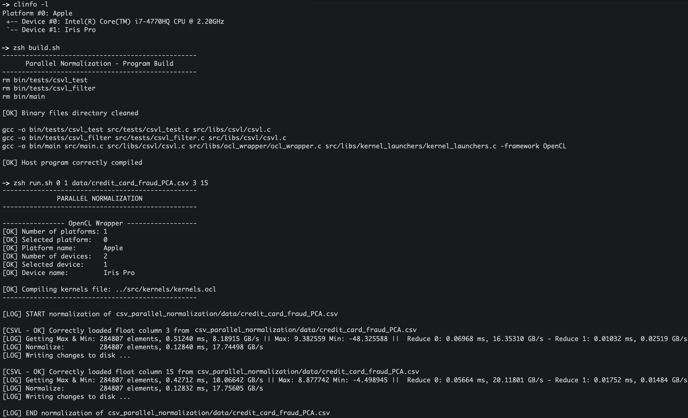

# CSV Parallel Normalization

“A desktop application that uses a chosen GPU and the OpenCL framework to normalize a dataset in range [0,1]”

## Installation and Run

zsh:

```sh
zsh build.sh
zsh run.sh OCL_PLATFORM_VALUE OCL_DEVICE_VALUE csv_pathname_to_normalize col_index1 col_index2 ... col_indexN
```

bash:

```sh
bash build.sh
bash run.sh OCL_PLATFORM_VALUE OCL_DEVICE_VALUE csv_pathname_to_normalize col_index1 col_index2 ... col_indexN
```


